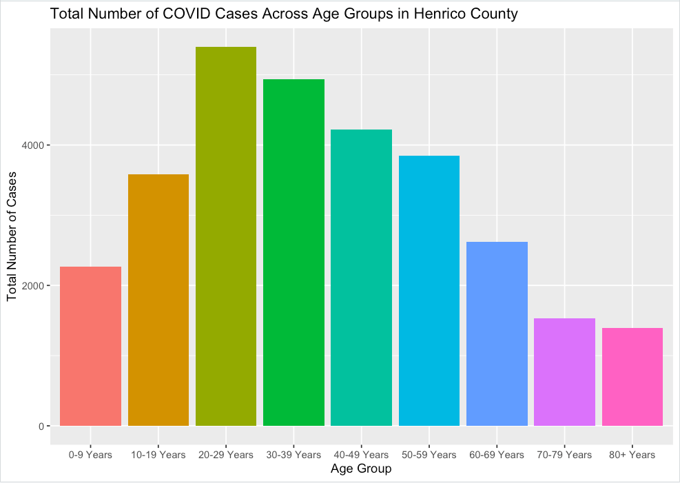

```{r setup, include=FALSE}
knitr::opts_chunk$set(echo = TRUE)
```

## Understanding the COVID pandemic in Henrico County VA

You’ve been recruited by the Virginia Department of Health to help better understand the impact of COVID on the people of Virginia.

This exam is your opportunity to demonstrate that you have a foundational knowledge of data visualizations and exploratory data analysis as well as the skills to use the R coding language to manipulate and visualize data.

Each question requires the synthesis of multiple concepts / skills, partial credit is given for all questions so answer as best you can. 

Good Luck!

There are two datasets that you'll need to explore for this exam:

- covid_data_by_week: This dataset has 5 variables: 
    1. Age_Group: Identifies the age range of COVID patients in Henrico County
    2. week_of: Indicates which week the data is pulling from
    3. sum_cases: the total number of covid cases reported that week
    4. sum_hospital: the total number COVID patients hospitalized that week 
    5. sum_deaths: the total number of deaths attributed to COVID that week 

- covid_data_sex: This dataset has 6 variables:
    1. Sex: Identifies the reported sex of COVID patients in the greater Richmond area
    2. week_of: Indicates which week the data is pulling from
    3. sum_cases: the total number of covid cases reported that week
    4. sum_hospital: the total number COVID patients hospitalized that week 
    5. sum_deaths: the total number of deaths attributed to COVID that week 
    6. HDistrict: Indicates which county the data is from
    

```{r import data and packages, message=FALSE, warning=FALSE, include=FALSE, output=FALSE, paged.print=FALSE}
library(lubridate)
library(tidyverse)

covid_data_by_week <- read_csv("data/covid_data_henrico_byweek.csv")
covid_data_sex <- read_csv("data/covid_data_greaterrichmondarea_byweek_sex.csv")
```

## Section 1: Henrico County Cases, Hospitalizations, and Deaths by Age Group

**Question 1:** Using the dataset covid_data_by_week, write the code required to create this visualization:


```{r Question 1 code}

```

**Question 2:** Create a visualzation (similar to question 1) that answers the question: which age group has the most hospitalizations?

```{r Question 2 code}

```

**Question 3:** Describe the insights that these two visualizations suggest about the pandemic in Henrico County Virginia.

How would you explore whether these trends have changed over time? No need to code for this question but be sure to use the terminology that we've discussed in class.
\
\
\
\
\
\
\
\
\
\

**Question 4:** The COVID-19 vaccines have been available to adults for most of 2021.

Describe (in complete sentences and using the terminology we’ve used in class) what the code below does. Feel free to describe the code line by line if you'd like.  
\
\
\
\
\
\
\
\
\
\

```{r Question 4 code}
summer_months <- c("May", "June", "July", "August")

do_vaccines_work <- covid_data_by_week %>%
  mutate(year = year(week_of),
         month = month(week_of, label = TRUE, abbr = FALSE))%>%
  filter(month %in% summer_months)%>%
  group_by(year, Age_Group)%>%
  summarise(total_cases = sum(sum_cases),
            total_hospitalized = sum(sum_hospital),
            total_deaths = sum(sum_deaths))%>%
  mutate(percent_hospitalized = total_hospitalized / total_cases, 
         percent_death = total_deaths / total_cases)
```

**Question 5:** Building on your response from question 4, what is a specific insight that you can derive from do_vaccines_work? What would be an effective way to visualize that insight?

No code required here - just identity the components you would use in your visualization.
\
\
\
\
\
\
\
\
\
\


## Section 2: Greater Richmond Cases, Hospitalizations, and Deaths by Sex

**Question 6:** Examine the data in covidsex_data.

Write an exploratory data analysis (EDA) question based on the data that would deepen our understanding of the role of sex (male or female) on COVID-19 outcomes. 

Note you may want to look at questions 7 and 8 before completing this question.
\
\
\
\
\
\
\
\
\
\

**Question 7:** What data transformation(s) (if any) and visualizations are required to answer your EDA question?

No code required but describe in detail how you’d approach your EDA question. Break down each data transformation and visualization component. 
\
\
\
\
\
\
\
\
\
\

**Question 8:** Create a visualization with R that answers your EDA question.
```{r Code for Question 8}


```


